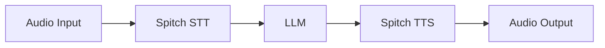

### Prerequisites

- Python 3.10 or higher
- Spitch API key
- Livekit API key, URL and secret key

### Installation & Setup

Install the following modules into your Python environment and setup your \*.env\* file with the following parameters.

```powershell
pip install "livekit-agents[spitch]"
```

<CodeGroup dropdown>

```.env
SPITCH_API_KEY=<Your Spitch API Key>
LIVEKIT_API_KEY=<your API Key>
LIVEKIT_API_SECRET=<your API Secret>
LIVEKIT_URL=<Your URL>
```

</CodeGroup>

## Integrating Spitch STT with Livekit

```python
from livekit.plugins import spitch

session = AgentSession(
   stt=spitch.STT(
      language="en",
   ),
)
```

### STT Parameters

<ParamField path="language" type="string" required>
  Check [here](https://docs.spitch.app/concepts/languages) for language options
</ParamField>

## Integrating Spitch TTS with Livekit

```python
from livekit.plugins import spitch

session = AgentSession(
   tts=spitch.TTS(
      language="en",
      voice="lina",
   )
)
```

### TTS Parameters

<ParamField path="language" default='en' type="string" required>
  Check [here](https://docs.spitch.app/concepts/languages) for language options
</ParamField>

<ParamField path="voice" default='en' type="string" required>
  Check [here](https://docs.spitch.app/concepts/voices) for voice options
</ParamField>


## Building a Voice Agent with Spitch
In this section, we would build an end-to-end voice agent using Spitch and Livekit. The flowchart below summarizes the architecture of our agent:

To get started, you'll need API keys for Spitch, Livekit and your preffered LLM. We will be making use of OpenAI in this demo. To find out more about which LLMs are available on Livekit, check out this [doc](https://docs.livekit.io/agents/integrations/llm/).

### Install packages
Install the following packages on your local computer to get started.
```bash
pip install \
  "livekit-agents[spitch,openai,silero,turn-detector]" \
  "livekit-plugins-noise-cancellation~=0.2" \
  "python-dotenv"
```

### Set up your environment variables
```bash .env
SPITCH_API_KEY=<Your Spitch API Key>
OPENAI_API_KEY=<Your OpenAI API Key>
LIVEKIT_API_KEY=<your API Key>
LIVEKIT_API_SECRET=<your API Secret>
LIVEKIT_URL=<Your Livekit URL>
```

### Voice Agent Code

```python agent.py focus={5,20,22}
from dotenv import load_dotenv
from livekit import agents
from livekit.agents import AgentSession, Agent, RoomInputOptions
from livekit.plugins import (
   spitch,
    openai,
    noise_cancellation,
    silero,
)
from livekit.plugins.turn_detector.multilingual import MultilingualModel

load_dotenv()

class Assistant(Agent):
    def __init__(self) -> None:
        super().__init__(instructions="You are a helpful voice AI assistant.") #You can change the instrruction to meet your unique use case.

async def entrypoint(ctx: agents.JobContext):
    session = AgentSession(
        stt=spitch.STT(language="en"),
        llm=openai.LLM(model="gpt-4o-mini"),
        tts=spitch.TTS(language="en", voice="lina")
        vad=silero.VAD.load(), #Voice Activity Detection Model
        turn_detection=MultilingualModel(), #Turn Detection Model
    )

    await session.start(
        room=ctx.room,
        agent=Assistant(),
        room_input_options=RoomInputOptions(
            noise_cancellation=noise_cancellation.BVC(), 
        ),
    )

    await session.generate_reply(
        instructions="Greet the user and offer your assistance."
    )


if __name__ == "__main__":
    agents.cli.run_app(agents.WorkerOptions(entrypoint_fnc=entrypoint))
```

### Running the Agent
<Steps>

   <Step title="Download model files" icon="arrow-down-from-bracket"> 
   Download the model files first to use the turn-detector, silero, or noise-cancellation plugins:
   <CodeGroup dropdown>
```bash
python agent.py download-files
```
   </CodeGroup>
   </Step>

   <Step title="Speak to the agent" icon="volume">
   Start your agent in console mode to run inside your terminal:
   <CodeGroup dropdown>
```bash
python agent.py console
```
   </CodeGroup>      
   </Step>

   <Step title="Connect the agent to the playground" icon="link">
   Start the agent in dev mode to connect it to LiveKit and make it available from anywhere on the internet:
   <CodeGroup dropdown>
```bash
python agent.py dev
```
     </CodeGroup>
   </Step>   

</Steps>


## Additional Resources
        <Columns>
            <Card
                title={"Integrating Spitch TTS in a Livekit voice agent"}
                icon={"message-code"}
                arrow={"true"}
                href={"https://docs.livekit.io/agents/integrations/tts/spitch/"}
                horizontal
            >
            </Card>
            <Card
                title={"Integrating Spitch STT in a Livekit voice agent"}
                icon={"waveform-lines"}
                arrow={"true"}
                href={"https://docs.livekit.io/agents/integrations/stt/spitch/"}
                horizontal
            >
            </Card>

        </Columns>