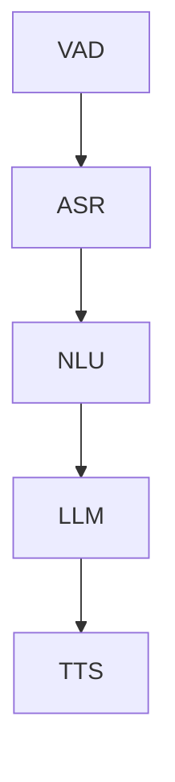

Voice agents are real-time systems that interact with users via spoken language. They often combine automatic speech recognition (ASR), natural language processing (NLP), text-to-speech (TTS), and even language translation to listen, understand, and respond to users in a conversational flow.

Voice agents:
<Steps>
    <Step icon="ear-listen">
        listen to voice input using ASR (Automatic Speech Recognition)
    </Step>
    <Step icon="arrow-progress">
        understand user intent using NLP (could be an LLM or a rule-based system)
    </Step>
    <Step icon="meteor">
        take action and return a reponse
    </Step>
    <Step icon="circle-waveform-lines">
        respond with synthesized speech using TTS
    </Step>
</Steps>

## The Voice Agent Pipeline
The typical voice agent is made up of the following steps:

1. <b>VAD (Voice Activity Detection):</b> This is responsible for detecting the precise moments when a user begins and stops speaking.
2. <b>ASR (Automatic Speech Recognition):</b> This feature transcribes input audio into text which is later passed on to the NLU system.
3. <b>NLU (Natural Language Understanding):</b> NLU examines the transcript to identify the user’s intent and extract key entities or parameters. This semantic analysis allows the agent to map user requests onto actionable commands or conversational flows.
4. <b>LLM (Large Language Model):</b> This element is responsible for generating the agent's next utterance based on the interpreted intent from speech and the user's conversation history.
5. <b>TTS (Text-to-Speech):</b> The TTS engine converts the agent’s chosen textual response into natural, human-like audio.

## Why Use Voice Agents?
Voice Agents have many benefits to developers and businesses alike and can be applied to automate operations across many sectors. Some of the benefits are:

- **Enhanced Accessibility & Engagement**  
  Voice Agents enable users with mobility or vision challenges to interact seamlessly with software.

- **Enable Hands-Free Interaction**  
  It helps customers multitask in scenarios like driving or cooking, making your app safer and more convenient.

- **Automate High-Volume Workloads**  
  Scale operations—handle customer support tickets, bookings, and order processing—without adding headcount.

In the next section, we’ll walk through how to build your own voice agent using Spitch SDKs.